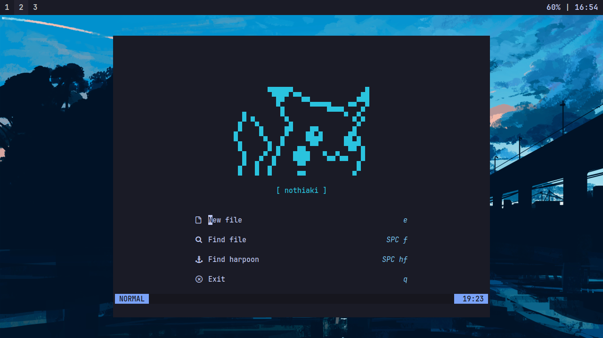

My first nvim configuration, hope you enjoy it!!!

### Install

dependencies: `lazyvim, git`

1. after download the lazyvim go to your .config directory and delete the `nvim/` file
2. past it you can paste this command  `git clone https://github.com/nothiaki/nvim.git` in the same directory you have deleted the nvim source
3. enjoy your nvim

the apparence should be like this:

thx for read this.
